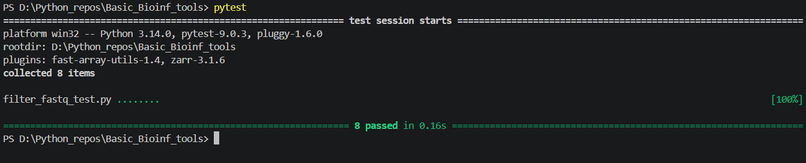

# Basic Bioinf tools

This repository contains simple tools to perform basic operations with DNA/RNA sequences and FASTQ-format data.

## Content

The script was made with Python 3.14.

Two main tools are available now:

1.  **Toolbox for DNA and RNA operations (as classes)**:
    *   `BiologicalSequence`: the main class to handle basic operations with sequences and check their alphabet.
    *   `NucleicAcidSequence`: the class derived from `BiologicalSequence` implements main methods for nucleic acid sequence analysis.
        *   `reverse`: Reverse the sequence.
        *   `complement`: Build complementary sequence.
        *   `reverse_complement`: Build reversed complementary sequence. 
    *   `DNASequence`/`RNASequence`:
        *   `transcribe`: Perform transcription and reverse transcription of given sequence.
    *   `AminoAcidSequence`:
        *   `molecular_weight`: calculates approximate molecular weight of the peptide.

2.  **Improved tool for FASTQ format filtering (filter_fastq.py)**:
    *   Input arguments must be in following format: 
        * input_fastq (str): name of input file
        * output_fastq (str): name of output file
        * gc_bounds: Tuple[float, float] - bounds for filtering by GC percentage
        * length_bounds: Tuple[int, int] - bounds for filtering by length
        * quality_threshold: float - threshold for filtering by quality
    *   Reads sequences in FASTQ format from file and filters by the given parameters.
    *   Implemented features:
        *   `logging` for operation completeness and exceptions
        *   Additional filter_fastq_test.py made with `pytest` to check the basic functions.
        *   CLI input for filter_fastq with `click`.

## Updates (05.10.2025)
    *   Add global constants in modules
    *   Rebuild `is_nucleic_acid` by reviewer's idea
    *   Fix `transcribe`

## Updates (12.10.2025)
    *   Fix data types in function definitions
    *   Fix repeating code in dna_rna_tools.py
    *   Move filter_fastq() from main.py into filter_fastq.py
    *   New run_filter_fastq() in main.py to operate filter_fastq.py quickly
    *   Add module io_fastq to control file input and output for run_filter_fastq()
    *   Small fixes in filter_fastq.py
    *   Fix imports in main.py
    *   Add new tool to work with FASTA format and BLAST output -> bio_files_processor.py
    *   Add new function -> convert_multiline_fasta_to_oneline() in bio_files_processor.py

## Updates (01.05.26)

    *   Refactor run_dna_rna_tools function and module dna_rna_tools.py into separate classes for biological sequence analysis.
    *   Filter_fastq function is built with `BioPython`(v.1.87) now.
    *   Filter_fastq uses `logging` now for logging exceptions and work completeness.
    *   New filter_fastq_test.py is a set of tests for `pytest`. All tests have been passed.
    *   Command line interface with `click`.

Pytest run completed!

